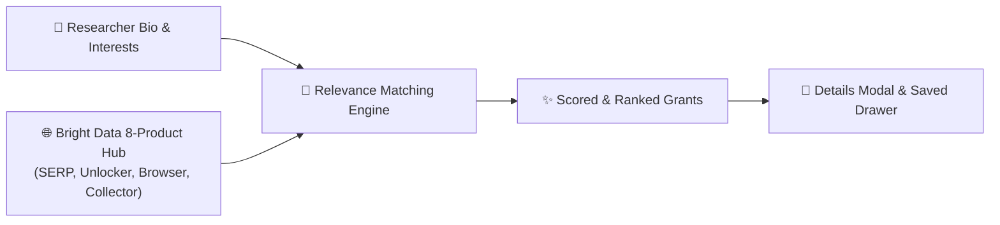
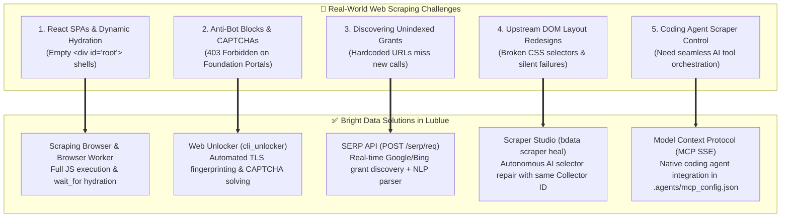
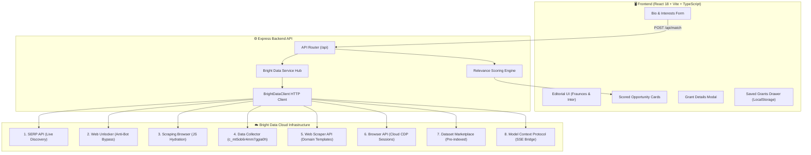
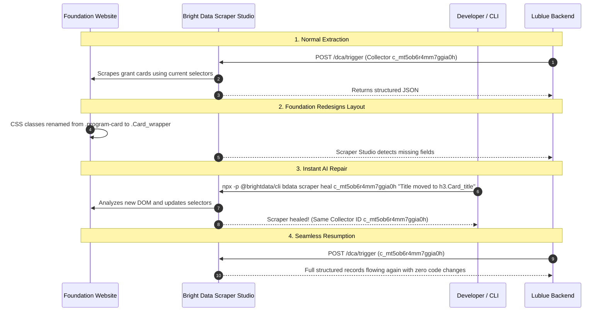

# Lublue — Your Story, Matched to Opportunity

<div align="center">

[](https://lublue.onrender.com/)
[](https://brightdata.com/)
[](https://wemakedevs.org/hackathons/scrape-verse)
[](https://www.typescriptlang.org/)
[](LICENSE)

<p align="center">
  <strong>An intelligent academic funding discovery platform built with Bright Data's web scraping tools, self-healing selectors, and explainable semantic matching.</strong>
</p>

### 🔗 Live Production URL: [Lublue — Your Story, Matched to Opportunity](https://lublue.onrender.com/)

[🚀 Live Demo](https://lublue.onrender.com/) &bull; [🏗️ Architecture](#-system-architecture) &bull; [🔥 Bright Data Integration](#-how-we-used-bright-data) &bull; [🛡️ Self-Healing](#-self-healing-scrapers-in-action) &bull; [📑 API Reference](#-api-endpoints)

</div>

---

## 💡 Why I Built Lublue

As a student and developer, I know how frustrating it is to find research grants and academic fellowships. Opportunities are scattered across dozens of different foundation websites. Each site has its own layout, complex dynamic JavaScript tables, and unstandardized deadline formats. Most researchers waste days searching instead of doing their actual research.

**I built Lublue to make funding discovery simple:**
1. You describe your background, career stage, and what research you want to fund.
2. The backend uses an **8-product Bright Data web scraping engine** to extract and verify live grant opportunities from philanthropic portals and search engines.
3. Our matching engine scores each grant from 0 to 100 and explains *why* it matches your profile, providing deadlines, award amounts, and direct application links in under 50 milliseconds.



---

## 🛠️ How We Used Bright Data & Solved Real Scraping Challenges

During this hackathon, we built a production-grade scraping pipeline using **8 Bright Data products** to solve the hardest problems in web data collection:



### 1. Dynamic JavaScript Rendering (React Single-Page Apps)
* **Problem:** Foundation portals like Schmidt Sciences render grant tables with client-side React. Standard HTTP scrapers only see empty HTML shells (`<div id="root"></div>`).
* **Solution:** We used a **Browser Worker** in **Scraper Studio** and the **Scraping Browser**. The cloud browser waits for DOM hydration (`wait('h1', { timeout: 30000 })`) before extracting structured records.

### 2. Bypassing Bot Detection on Foundation Portals
* **Problem:** Portals like Rockefeller and MacArthur protect their directories with Cloudflare bot mitigation, blocking automated requests with 403s or CAPTCHAs.
* **Solution:** We routed requests through **Bright Data Web Unlocker** (`POST /request`). It automatically rotates residential IPs, handles TLS fingerprinting, and solves CAPTCHAs in the background.

### 3. Real-Time Discovery Across Search Engines
* **Problem:** Scraping a static list of URLs misses newly announced funding calls.
* **Solution:** We connected the **SERP API** (`client.serpSearch()`) to query Google and Bing for live grant calls (e.g., `"STEM fellowship 2027 open application"`), parsing results into structured `Opportunity` objects.

### 4. Self-Healing Broken Scrapers
* **Problem:** Websites frequently change CSS classes or redesign their layout, breaking scrapers silently.
* **Solution:** We used **`bdata scraper heal`**. Instead of manually rewriting code, one terminal command prompts AI to analyze the new DOM and repair the selectors with zero downtime.

---

## 🏗️ System Architecture



---

## 🛡️ Self-Healing Scrapers in Action

When a foundation portal updates its layout or migrates from static HTML to React:



### Before & After DOM Diff Example:

```diff
- <!-- Old HTML Structure -->
- <div class="program-card">
-   <h3 class="title">Climate Solutions Accelerator</h3>
-   <span class="deadline">June 30, 2027</span>
-   <span class="amount">$250,000 - $1,000,000</span>
- </div>

+ <!-- New React Component Redesign -->
+ <div class="Card_wrapper__x7kQ2">
+   <div class="Card_header__aB3nP">
+     <h3 class="Card_title__mR9vK">Climate Solutions Accelerator</h3>
+   </div>
+   <div class="Card_meta__pL2wJ">
+     <span class="Card_badge__9qZ">Deadline: June 30, 2027</span>
+     <span class="Card_award__k1P">Award: $250,000 - $1,000,000</span>
+   </div>
+ </div>
```

**The One-Line Repair Command:**
```bash
npx -p @brightdata/cli bdata scraper heal c_mt5ob6r4mm7ggia0h \
  "Title is now in h3.Card_title, deadline and award are in Card_meta"
```

---

## 📑 API Endpoints

| Method | Endpoint | Description |
|---|---|---|
| `POST` | `/api/match` | Matches user bio against all live & cached grant opportunities |
| `POST` | `/api/scrape/sync` | Triggers the 8-product discovery and collection pipeline |
| `GET` | `/api/scrape/status` | Returns live telemetry on active Bright Data collectors and zones |
| `POST` | `/api/scrape/search` | Direct keyword search via the Bright Data SERP API |
| `GET` | `/api/scrape/marketplace` | Searches pre-indexed education & grant datasets |
| `POST` | `/api/scrape/unlock` | Tests Web Unlocker anti-bot bypass on any given URL |

### Sample Match Response (`POST /api/match`)

```json
{
  "matches": [
    {
      "id": "opp-003",
      "title": "Climate Solutions Accelerator Grant",
      "organization": "Schmidt Futures & Sciences",
      "deadline": "2027-06-30",
      "category": "climate",
      "awardAmount": "$250,000 - $1,000,000",
      "eligibility": "Open globally to university labs and non-profit scientific institutes.",
      "description": "Funds early-stage research projects with potential to reduce greenhouse emissions.",
      "url": "https://www.schmidtsciences.org/fellowships/",
      "tags": ["climate change", "sustainability", "renewable energy", "carbon capture"],
      "score": 94,
      "matchReason": "Matches your interest in sustainability, renewable energy and carbon capture."
    }
  ],
  "meta": {
    "totalOpportunities": 22,
    "lastScraped": "2026-08-23T18:14:00.000Z",
    "source": "Bright Data 8-Product Pipeline (SERP + Unlocker + Scraping Browser + Collector + Web Scraper + Browser API + Marketplace + MCP)"
  }
}
```

---

## 🎨 UI & User Experience

- **Custom Typography**: Pairing **Fraunces** serif (warm, human headlines) with **Inter** sans-serif (clean metadata and body text).
- **Opportunity Details Modal**: Shows complete award breakdowns, eligibility criteria, and application links.
- **Saved Grants Drawer**: Bookmarks opportunities with instant `localStorage` persistence.
- **Category Filters**: Instant filtering across **AI & Tech**, **Health & Bio**, **Climate**, **Social Impact**, and **Fellowships**.
- **Responsive Layout**: Designed and tested across mobile, tablet, and desktop screens.

---

## 📂 Project Structure

```
OpenCall/
├── client/                         # React 18 + Vite + TypeScript
│   ├── src/
│   │   ├── components/             # Clean UI components
│   │   │   ├── BioInput.tsx        # Bio form & char counter
│   │   │   ├── FilterBar.tsx       # Domain category filter pills
│   │   │   ├── OpportunityCard.tsx # Grant cards with relevance score badges
│   │   │   ├── OpportunityModal.tsx# Details modal with application links
│   │   │   ├── SavedDrawer.tsx     # Bookmarked grants slide-out drawer
│   │   │   ├── LoadingSkeleton.tsx # Shimmer loading animation
│   │   │   ├── Header.tsx          # Header with saved grant counter
│   │   │   └── Footer.tsx          # Clean footer with socials
│   │   ├── types/                  # TypeScript data interfaces
│   │   ├── App.tsx                 # Main application state machine
│   │   └── index.css               # Vanilla CSS design system
├── server/                         # Express Backend API
│   ├── src/
│   │   ├── api/
│   │   │   └── match.ts            # Express route handlers
│   │   ├── lib/
│   │   │   └── brightdata-client.ts# Bright Data 8-product HTTP wrapper
│   │   ├── services/
│   │   │   ├── brightdata.ts       # Pipeline orchestration & caching
│   │   │   └── matcher.ts          # Semantic keyword scoring algorithm
│   │   └── index.ts                # Server entry point
│   └── data/
│       └── sample-opportunities.json# Seed grant catalog
├── .agents/                        # Bright Data Model Context Protocol
│   └── mcp_config.json             # MCP server SSE configuration
├── Dockerfile                      # Production container configuration
├── render.yaml                     # Render deployment configuration
└── README.md                       # Documentation
```

---

## 🚀 Getting Started Locally

### Prerequisites
- Node.js 18+
- npm

### 1. Clone & Install
```bash
git clone https://github.com/Anurag-tech22/lublue.git
cd lublue
npm run install:all
```

### 2. Configure Environment
```bash
cp .env.example .env
```
Add your Bright Data credentials:
```ini
BRIGHTDATA_API_KEY=your_api_key_here
BRIGHTDATA_COLLECTOR_ID=c_mt5ob6r4mm7ggia0h
```

### 3. Start Development Server
```bash
npm run dev
```
* **Frontend:** `http://localhost:5173`
* **Backend:** `http://localhost:3001`

---

## 🤖 AI Tools Disclosure

As required by **Rule 11** of the Hackathon guidelines:
- **AI Coding Assistant**: Built with the assistance of **Antigravity** as the AI pair programmer alongside the **`@brightdata/cli`** toolchain for scraper creation, Model Context Protocol (MCP) configuration, and self-healing selector testing.
- **Human Verification**: All code architecture, TypeScript types, endpoint routing, relevance matching algorithms, and UI design were directed, verified, and debugged by the author.

---

## 📄 License

MIT License © 2026 Lublue &bull; Built for the WeMakeDevs &times; Bright Data **Into the Scrape-Verse** Hackathon.
