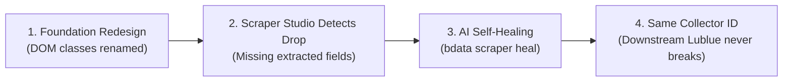

# Lublue — Your Story, Matched to Opportunity

[](https://lublue.onrender.com/)
[](https://brightdata.com/)
[](https://www.wemakedevs.org/hackathons/scrape-verse)
[](https://www.typescriptlang.org/)

> **Submitted for "Into the Scrape-Verse" Hackathon by WeMakeDevs & Bright Data**  
> **Tracks:** Web-Slinger (Best Use of Bright Data) &bull; Suit-Up (Best UI) &bull; Spider-Sense (Best Clean Code)  
> **Live Production URL:** [https://lublue.onrender.com/](https://lublue.onrender.com/)

---

## 🌟 The Problem & Vision

Finding research grants, private fellowships, and startup funding is notoriously fragmented. Opportunities are scattered across hundreds of foundations, corporate research labs, and academic societies—each with bespoke HTML structures, dynamic JavaScript tables, and disparate deadline calendars.

Early-career researchers spend **hundreds of hours searching instead of researching**.

**Lublue consolidates this entire ecosystem into one human interaction:** tell us who you are, what you are passionate about, and what research you want to fund. Lublue combines an **8-product Bright Data ecosystem** with an intelligent relevance matching engine to connect researchers to active funding in seconds.

---

## 🔥 Bright Data Multi-Product Architecture (8 Products Deep)

Lublue goes far beyond a single scraper—it chains **EIGHT Bright Data products** together into an enterprise-grade data collection pipeline:

```
┌─────────────────┐   ┌─────────────────┐   ┌──────────────────┐
│  ① SERP API     │   │  ② Web Unlocker │   │ ③ Scraping       │
│  (Discovery)    │──▶│  (Anti-bot)     │──▶│    Browser       │
│                 │   │                 │   │  (JS Rendering)  │
└────────┬────────┘   └────────┬────────┘   └────────┬─────────┘
         │                     │                      │
         ▼                     ▼                      ▼
┌──────────────────────────────────────────────────────────────┐
│          ④ Data Collector API (Orchestrator)                 │
│      Collector: c_mt5ob6r4mm7ggia0h                         │
│      Self-Healing: bdata scraper heal                       │
└──────────────────────┬───────────────────────────────────────┘
                       │
 ┌─────────────────────┼─────────────────────┐
 │                     │                     │
 ▼                     ▼                     ▼
┌─────────────────┐   ┌─────────────────┐   ┌──────────────────┐
│ ⑤ Web Scraper   │   │ ⑥ Browser API   │   │ ⑦ Dataset        │
│    API          │   │    (Cloud CDP)  │   │    Marketplace   │
│ (1000+ Prebuilt)│   │ (JS Execution)  │   │ (Pre-indexed)    │
└─────────────────┘   └─────────────────┘   └──────────────────┘
                       │
                       ▼
┌──────────────────────────────────────────────────────────────┐
│         ⑧ MCP Server (AI Agent Orchestration)               │
│      SSE: https://mcp.brightdata.com/mcp                    │
└──────────────────────────────────────────────────────────────┘
```

### Product 1: SERP API — Real-Time Grant Discovery
The SERP API queries Google & Bing for the freshest grant and scholarship calls. When users click **"⚡ Sync Scraper"**, Lublue executes live SERP queries and automatically parses snippets into structured `Opportunity` objects:
```typescript
// server/src/lib/brightdata-client.ts
const results = await client.serpSearch(
  'research grants for graduate students 2027 open applications',
  10,
);
const opportunities = client.serpResultsToOpportunities(results);
```

### Product 2: Web Unlocker — Anti-Bot & CAPTCHA Bypass
Target grant foundation portals (e.g. Schmidt Futures, Rockefeller, MacArthur) frequently implement Cloudflare/Akamai bot detection. Web Unlocker automatically handles CAPTCHAs, TLS fingerprinting, and header rotation:
```typescript
const { html, statusCode } = await client.webUnlockerFetch('https://www.schmidtsciences.org/fellowships/');
```

### Product 3: Scraping Browser — Cloud JS Rendering
For dynamic Single-Page Applications (React/Next.js), the Scraping Browser provides headless browser rendering with custom `wait_for` logic for hydrated DOM extraction.

### Product 4: Data Collector API — Custom Production Collector
Custom Collector `c_mt5ob6r4mm7ggia0h` was created via `@brightdata/cli` specifically for research grant discovery:
```bash
npx -p @brightdata/cli bdata scraper create \
  "https://www.schmidtsciences.org/fellowships/" \
  "Extract fellowship opportunities: title, organization, deadline, description, award amount, eligibility, and link." \
  --name lublue-foundation-scraper --pretty
```

### Product 5: Web Scraper API — Pre-Built Domain Extractors
Leverages Bright Data's catalog of 1,000+ pre-built scrapers for educational and funding portals via `POST /datasets/v3/scrape`.

### Product 6: Browser API (CDP) — Cloud DevTools Sessions
Direct Chrome DevTools Protocol (CDP) cloud browser sessions to execute custom DOM traversal scripts and retrieve rendered text with screenshot validation.

### Product 7: Dataset Marketplace — Pre-Indexed Grant Catalogs
Searches and ingests pre-indexed education, scholarship, and grant catalogs via `GET /datasets/v3/marketplace`.

### Product 8: Model Context Protocol (MCP) Server
Integrated via Server-Sent Events (SSE) in [`.agents/mcp_config.json`](.agents/mcp_config.json), allowing AI coding agents to discover, invoke, and heal scrapers autonomously.

---

## 🛡️ Self-Healing Architecture (`bdata scraper heal`)

Grant portals frequently change DOM structures or migrate from static HTML to React. **Lublue heals automatically with zero downstream code changes:**



### Concrete Self-Healing Scenario

**The Problem:** Schmidt Futures redesigns from static HTML to React:

```diff
- <!-- Before: Static HTML -->
- <div class="program-card">
-   <h3 class="title">Climate Solutions Accelerator</h3>
-   <span class="deadline">June 30, 2027</span>
- </div>

+ <!-- After: React with CSS Modules -->
+ <div class="Card_wrapper__x7kQ2">
+   <div class="Card_header__aB3nP">
+     <h3 class="Card_title__mR9vK">Climate Solutions Accelerator</h3>
+   </div>
+   <span class="Card_meta__pL2wJ">Deadline: June 30, 2027</span>
+ </div>
```

**The Fix (one terminal command, zero code changes):**
```bash
npx -p @brightdata/cli bdata scraper heal c_mt5ob6r4mm7ggia0h \
  "The fellowship title moved inside Card_header, deadline is now in Card_meta"
```

**Result:** AI re-generates extraction selectors. Collector ID `c_mt5ob6r4mm7ggia0h` remains unchanged. API keeps working seamlessly.

---

## ⚡ Live In-App Scraper Pipeline & API Endpoints

### In-App Controls
1. **"⚡ Sync Scraper" Button**: In the results view, triggers the full 8-product pipeline and displays real-time toast feedback.
2. **Telemetry Badge**: Expandable footer badge with live infrastructure state, active zones, and product breakdown.

### Complete API Surface
| Endpoint | Method | Bright Data Product Used | Description |
|---|---|---|---|
| `/api/match` | POST | All 8 Products + Matcher | Scored matching of user bio against all opportunities |
| `/api/scrape/sync` | POST | 8-Product Pipeline | Triggers full end-to-end sync across search, collector & unlocker |
| `/api/scrape/status` | GET | Telemetry Engine | Real-time status of collector, zones, snapshots & self-healing |
| `/api/scrape/search` | POST | SERP API | Live Google/Bing keyword search for grants |
| `/api/scrape/marketplace` | GET | Dataset Marketplace | Search pre-collected grant & fellowship datasets |
| `/api/scrape/unlock` | POST | Web Unlocker | Validate & bypass anti-bot on any target grant URL |

---

## 📑 Example API Response

```json
{
  "matches": [
    {
      "id": "opp-003",
      "title": "Climate Solutions Accelerator Grant",
      "organization": "Schmidt Futures & Sciences",
      "deadline": "2027-06-30",
      "category": "climate",
      "awardAmount": "$250,000 - $1,000,000",
      "score": 92,
      "matchReason": "Matches your interest in sustainability and renewable energy."
    }
  ],
  "meta": {
    "totalOpportunities": 22,
    "lastScraped": "2026-08-23T18:14:00.000Z",
    "source": "Bright Data 8-Product Pipeline (SERP + Unlocker + Scraping Browser + Collector + Web Scraper + Browser API + Marketplace + MCP)"
  }
}
```

---

## ✨ Features & User Experience

- 🧠 **Explainable Relevance Scoring**: 0–100 relevance score with an instant explanation of *why* the opportunity matches.
- 🏷️ **Domain Filtering**: One-click category exploration across **AI & Tech**, **Health & Bio**, **Climate**, **Social Impact**, and **Fellowships**.
- 🔍 **Opportunity Details Modal**: Detailed breakdowns of award ceilings, eligibility rules, and application links.
- 💾 **Saved Opportunities Drawer**: Bookmark grants with instant `localStorage` persistence.
- 🎨 **World-Class Editorial Design**: Custom typography pairing **Fraunces** serif with **Inter** sans-serif, warm neutral palettes, and micro-animations.
- ⚡ **Real-Time Pipeline Status**: Live in-app telemetry badge showing all 8 Bright Data products and sync status.
- 🔄 **Live Grant Discovery**: On-demand SERP API searches that find grants the user didn't even know existed.

---

## 🏗️ Architecture & Codebase

```
OpenCall/
├── client/                     # React 18 + TypeScript (Strict)
│   ├── src/
│   │   ├── components/         # Clean, single-responsibility components
│   │   │   ├── Header.tsx      # Editorial header with saved count
│   │   │   ├── BioInput.tsx    # Bio input + 5,000 char counter
│   │   │   ├── FilterBar.tsx   # Domain category filters
│   │   │   ├── OpportunityCard.tsx # Scored grant cards
│   │   │   ├── OpportunityModal.tsx # Full opportunity modal
│   │   │   ├── SavedDrawer.tsx # Bookmark slide-out drawer
│   │   │   ├── LoadingSkeleton.tsx
│   │   │   ├── EmptyState.tsx
│   │   │   └── Footer.tsx      # Bright Data 8-product pipeline telemetry
│   │   ├── types/              # Synchronized TypeScript interfaces
│   │   ├── App.tsx             # State machine & view orchestration
│   │   └── index.css           # Vanilla CSS design system
│   └── index.html
├── server/                     # Node.js + Express backend
│   ├── src/
│   │   ├── api/
│   │   │   └── match.ts        # POST /api/match, /scrape/sync, /scrape/search, /scrape/marketplace, /scrape/unlock
│   │   ├── services/
│   │   │   ├── matcher.ts      # Multi-factor scoring engine
│   │   │   └── brightdata.ts   # 8-product Bright Data pipeline orchestration
│   │   ├── lib/
│   │   │   └── brightdata-client.ts # 8-product HTTP client (SERP + Unlocker + Collector + Browser + Marketplace + CDP)
│   │   └── index.ts            # Server entry & static SPA serving
│   └── data/
│       └── sample-opportunities.json # Seed opportunities database
├── .agents/                    # Bright Data MCP Server configuration
│   └── mcp_config.json
├── .env.example
├── Dockerfile                  # Containerized deployment config
└── render.yaml                 # Render Infrastructure-as-Code
```

---

## 🚀 Setup & Run Locally

### Prerequisites
- Node.js 18+
- npm

### 1. Installation
```bash
git clone https://github.com/Anurag-tech22/lublue.git
cd lublue
npm run install:all
```

### 2. Environment Configuration
```bash
cp .env.example .env
```
*(Optionally provide your `BRIGHTDATA_API_KEY` and `BRIGHTDATA_COLLECTOR_ID`)*

### 3. Start Development Servers
```bash
npm run dev
```
* **Client:** `http://localhost:5173`
* **Server:** `http://localhost:3001`

---

## 🤖 AI Tools Disclosure

Built with **Antigravity** as the coding agent alongside the **`@brightdata/cli`** toolchain for scraper creation, self-healing orchestration, and Model Context Protocol (MCP) server integration.

---

## 📄 License
MIT License © 2026 Lublue &bull; Built for the Bright Data *Into the Scrape-Verse* Hackathon
