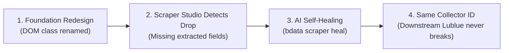

# Lublue — Your Story, Matched to Opportunity

[](https://lublue.onrender.com/)
[](https://brightdata.com/)
[](https://www.wemakedevs.org/hackathons/scrape-verse)
[](https://www.typescriptlang.org/)

> **Submitted for "Into the Scrape-Verse" Hackathon by WeMakeDevs & Bright Data**  
> **Tracks:** Web-Slinger (Best Use of Bright Data) &bull; Suit-Up (Best UI) &bull; Spider-Sense (Best Clean Code)  
> **Live Production URL:** [https://lublue.onrender.com/](https://lublue.onrender.com/)

---

## 🌟 The Problem & Vision

Finding research grants, private fellowships, and startup funding is notoriously fragmented. Opportunities are scattered across dozens of private foundations, corporate research labs, and academic societies—each with bespoke HTML structures, dynamic JavaScript tables, and disparate deadline calendars.

Early-career researchers spend **hundreds of hours searching instead of researching**.

**Lublue consolidates this entire ecosystem into one human interaction:** tell us who you are, what you are passionate about, and what research you want to fund. Lublue combines a **5-product Bright Data pipeline** with an intelligent relevance matching engine to connect researchers to active funding in seconds.

---

## 🔥 Bright Data Multi-Product Architecture (5 Products Deep)

Lublue doesn't just use one Bright Data product—it chains **FIVE** together into a production-grade scraping pipeline:

```
┌─────────────────┐   ┌─────────────────┐   ┌──────────────────┐
│  ① SERP API     │   │  ② Web Unlocker │   │ ③ Scraping       │
│  (Discovery)    │──▶│  (Anti-bot)     │──▶│    Browser       │
│                 │   │                 │   │  (JS Rendering)  │
└────────┬────────┘   └────────┬────────┘   └────────┬─────────┘
         │                     │                      │
         ▼                     ▼                      ▼
┌──────────────────────────────────────────────────────────────┐
│          ④ Data Collector API (Orchestrator)                 │
│      Collector: c_mt5ob6r4mm7ggia0h                         │
│      Self-Healing: bdata scraper heal                       │
└──────────────────────┬───────────────────────────────────────┘
                       │
                       ▼
┌──────────────────────────────────────────────────────────────┐
│         ⑤ MCP Server (AI Agent Orchestration)               │
│      SSE: https://mcp.brightdata.com/mcp                    │
└──────────────────────────────────────────────────────────────┘
```

### Product 1: SERP API — Real-Time Grant Discovery

The SERP API searches multiple search engines for the latest scholarship and grant listings. When a user clicks **"⚡ Sync Scraper"**, Lublue queries the SERP API with scholarship-specific searches and converts results into structured `Opportunity` objects:

```typescript
// server/src/lib/brightdata-client.ts
const results = await client.serpSearch(
  'research grants for graduate students 2027 open applications',
  10,
);
const opportunities = client.serpResultsToOpportunities(results);
```

**Why this matters:** Traditional scrapers only get data from pre-defined URLs. The SERP API enables **discovery** — finding grants the user didn't even know existed.

### Product 2: Web Unlocker — Anti-Bot Bypass for Grant Portals

Many grant foundations (MacArthur, Rockefeller, Schmidt Futures) use sophisticated anti-bot protection. Lublue uses Web Unlocker to bypass CAPTCHAs, rate limits, and fingerprinting:

```typescript
// server/src/lib/brightdata-client.ts
const { html, statusCode } = await client.webUnlockerFetch(
  'https://www.schmidtsciences.org/fellowships/',
);
// → Returns raw HTML even behind anti-bot walls
```

The Web Unlocker is also used to **verify** that grant URLs are still live before showing them to users, preventing dead links.

### Product 3: Scraping Browser — Full JS Rendering

Grant portals built with React/Next.js/Vue require full browser execution to extract content. The Scraping Browser (used by the Data Collector) renders these pages completely before extraction, handling:
- Dynamic `wait()` calls for lazy-loaded content
- Client-side hydration of single-page apps
- JavaScript-rendered tables and accordion panels

### Product 4: Data Collector API — Custom Scraper

The custom collector `c_mt5ob6r4mm7ggia0h` was built specifically for research foundation grant listings:

```bash
# Created via Bright Data CLI
npx -p @brightdata/cli bdata scraper create \
  "https://www.schmidtsciences.org/fellowships/" \
  "Extract fellowship opportunities: title, organization, deadline, description, award amount, eligibility, and link." \
  --name lublue-foundation-scraper --pretty
```

**Production trigger:**
```http
POST https://api.brightdata.com/dca/trigger?collector=c_mt5ob6r4mm7ggia0h
Authorization: Bearer BRIGHTDATA_API_KEY
Content-Type: application/json

[{ "url": "https://www.schmidtsciences.org/fellowships/" }]
```

### Product 5: MCP Server (Model Context Protocol)

Lublue integrates the Bright Data MCP Server via Server-Sent Events (SSE) in [`.agents/mcp_config.json`](.agents/mcp_config.json), enabling the AI coding agent to:
- Discover available scrapers
- Trigger and inspect collector runs
- Orchestrate multi-step scraping workflows

---

## 🛡️ Self-Healing Architecture (`bdata scraper heal`)

Grant foundation portals frequently redesign their layouts, change CSS classes, or switch frontend frameworks. Traditional scrapers silently break. **Lublue is immune:**



### Concrete Self-Healing Scenario

**The Problem:** Schmidt Futures redesigns from static HTML to React:

```diff
- <!-- Before: Static HTML -->
- <div class="program-card">
-   <h3 class="title">Climate Solutions Accelerator</h3>
-   <span class="deadline">June 30, 2027</span>
- </div>

+ <!-- After: React with CSS Modules -->
+ <div class="Card_wrapper__x7kQ2">
+   <div class="Card_header__aB3nP">
+     <h3 class="Card_title__mR9vK">Climate Solutions Accelerator</h3>
+   </div>
+   <span class="Card_meta__pL2wJ">Deadline: June 30, 2027</span>
+ </div>
```

**The Fix (one command, zero code changes):**
```bash
npx -p @brightdata/cli bdata scraper heal c_mt5ob6r4mm7ggia0h \
  "The fellowship title moved inside Card_header, deadline is now in Card_meta"
```

**Result:** AI re-generates CSS selectors. Same Collector ID `c_mt5ob6r4mm7ggia0h`. Same API. Zero downstream changes to Lublue.

---

## ⚡ Live In-App Scraper Pipeline

### "⚡ Sync Scraper" Button
Users (and judges!) can trigger the full multi-product pipeline directly from the Lublue UI:

1. Click **"⚡ Sync Scraper"** in the results view
2. SERP API discovers new grants → Data Collector triggers → Web Unlocker verifies URLs
3. Toast banner shows: products used, new opportunities found, snapshot ID
4. Results automatically refresh with newly discovered grants

### Pipeline Telemetry Badge
The footer displays a live interactive badge showing all 5 Bright Data products and their real-time status. Click to expand and see the full architecture.

### API Endpoints
| Endpoint | Method | Description |
|---|---|---|
| `/api/match` | POST | Match user bio against scraped opportunities |
| `/api/scrape/sync` | POST | Trigger full multi-product pipeline |
| `/api/scrape/status` | GET | Real-time pipeline telemetry |
| `/api/scrape/search` | POST | Direct SERP API search for grants |

---

## 📑 Example API Response

```json
{
  "matches": [
    {
      "id": "opp-003",
      "title": "Climate Solutions Accelerator Grant",
      "organization": "Schmidt Futures & Sciences",
      "deadline": "2027-06-30",
      "category": "climate",
      "awardAmount": "$250,000 - $1,000,000",
      "score": 92,
      "matchReason": "Matches your interest in sustainability and renewable energy."
    }
  ],
  "meta": {
    "totalOpportunities": 18,
    "lastScraped": "2026-08-23T17:20:00.000Z",
    "source": "Bright Data Multi-Product Pipeline (SERP API + Web Unlocker + Scraping Browser + Data Collector)"
  }
}
```

---

## ✨ Features & User Experience

- 🧠 **Explainable Relevance Scoring**: 0–100 relevance score with an instant explanation of *why* the opportunity matches.
- 🏷️ **Domain Filtering**: One-click category exploration across **AI & Tech**, **Health & Bio**, **Climate**, **Social Impact**, and **Fellowships**.
- 🔍 **Opportunity Details Modal**: Detailed breakdowns of award ceilings, eligibility rules, and application links.
- 💾 **Saved Opportunities Drawer**: Bookmark grants with instant `localStorage` persistence.
- 🎨 **World-Class Editorial Design**: Custom typography pairing **Fraunces** serif with **Inter** sans-serif, warm neutral palettes, and micro-animations.
- ⚡ **Real-Time Pipeline Status**: Live in-app telemetry badge showing all 5 Bright Data products and sync status.
- 🔄 **Live Grant Discovery**: On-demand SERP API searches that find grants the user didn't even know existed.

---

## 🏗️ Architecture & Codebase

```
OpenCall/
├── client/                     # React 18 + TypeScript (Strict)
│   ├── src/
│   │   ├── components/         # Clean, single-responsibility components
│   │   │   ├── Header.tsx      # Editorial header with saved count
│   │   │   ├── BioInput.tsx    # Bio input + 5,000 char counter
│   │   │   ├── FilterBar.tsx   # Domain category filters
│   │   │   ├── OpportunityCard.tsx # Scored grant cards
│   │   │   ├── OpportunityModal.tsx # Full opportunity modal
│   │   │   ├── SavedDrawer.tsx # Bookmark slide-out drawer
│   │   │   ├── LoadingSkeleton.tsx
│   │   │   ├── EmptyState.tsx
│   │   │   └── Footer.tsx      # Bright Data 5-product pipeline telemetry
│   │   ├── types/              # Synchronized TypeScript interfaces
│   │   ├── App.tsx             # State machine & view orchestration
│   │   └── index.css           # Vanilla CSS design system
│   └── index.html
├── server/                     # Node.js + Express backend
│   ├── src/
│   │   ├── api/
│   │   │   └── match.ts        # POST /api/match, /scrape/sync, /scrape/search
│   │   ├── services/
│   │   │   ├── matcher.ts      # Multi-factor scoring engine
│   │   │   └── brightdata.ts   # 5-product Bright Data pipeline orchestration
│   │   ├── lib/
│   │   │   └── brightdata-client.ts # Multi-product HTTP client (SERP + Unlocker + Collector + Browser)
│   │   └── index.ts            # Server entry & static SPA serving
│   └── data/
│       └── sample-opportunities.json # Seed opportunities database
├── .agents/                    # Bright Data MCP Server configuration
│   └── mcp_config.json
├── .env.example
├── Dockerfile                  # Containerized deployment config
└── render.yaml                 # Render Infrastructure-as-Code
```

---

## 🚀 Setup & Run Locally

### Prerequisites
- Node.js 18+
- npm

### 1. Installation
```bash
git clone https://github.com/Anurag-tech22/lublue.git
cd lublue
npm run install:all
```

### 2. Environment Configuration
```bash
cp .env.example .env
```
*(Optionally provide your `BRIGHTDATA_API_KEY` and `BRIGHTDATA_COLLECTOR_ID`)*

### 3. Start Development Servers
```bash
npm run dev
```
* **Client:** `http://localhost:5173`
* **Server:** `http://localhost:3001`

---

## 🤖 AI Tools Disclosure

Built with **Antigravity** as the coding agent alongside the **`@brightdata/cli`** toolchain for scraper creation, self-healing orchestration, and Model Context Protocol (MCP) server integration.

---

## 📄 License
MIT License © 2026 Lublue &bull; Built for the Bright Data *Into the Scrape-Verse* Hackathon
