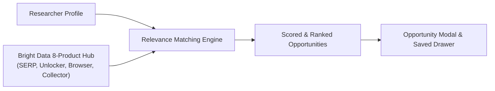
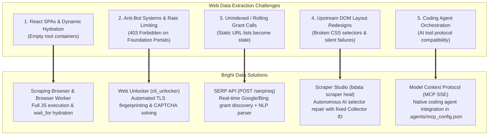
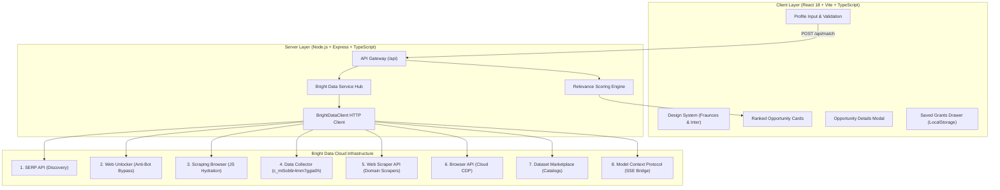
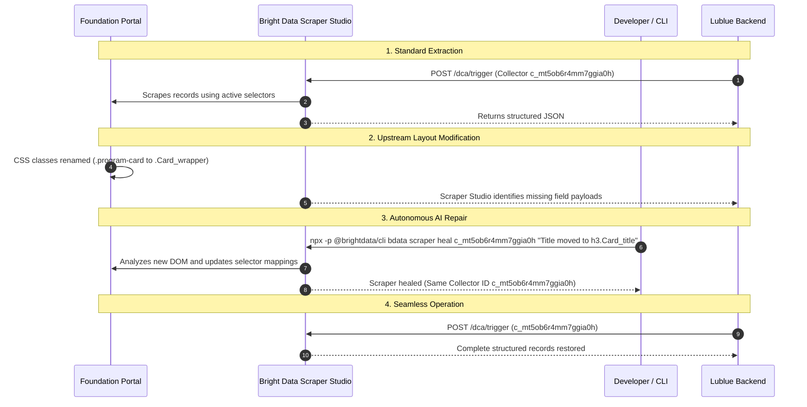
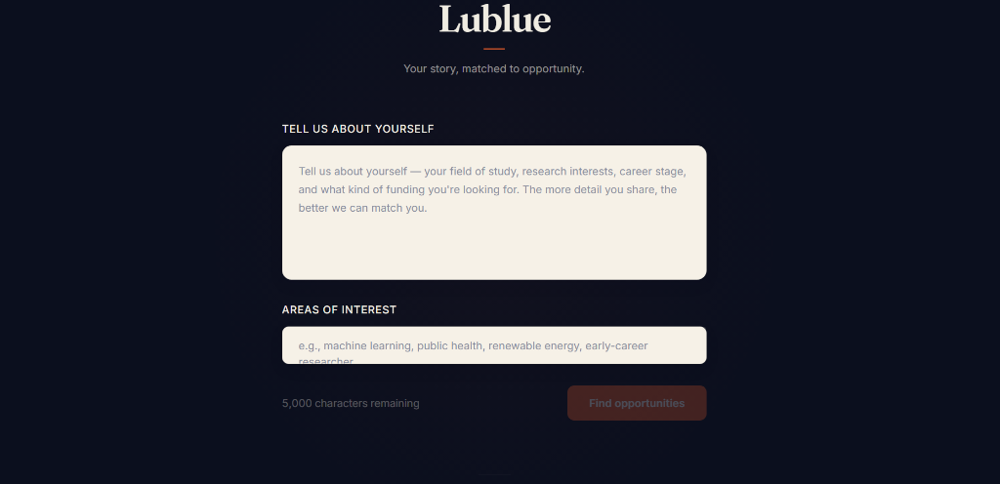
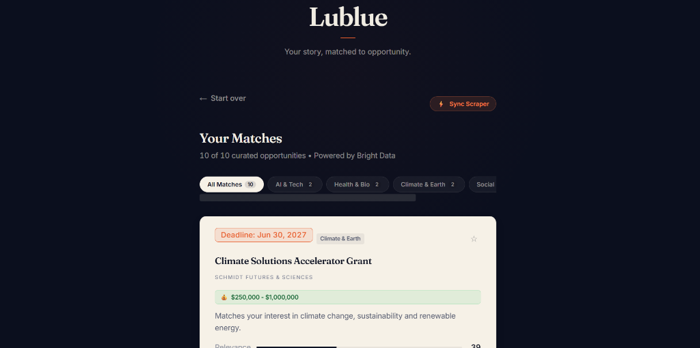
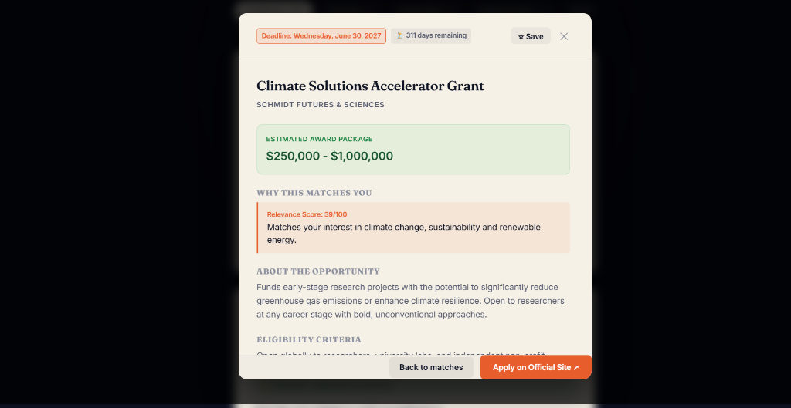

# Lublue — Your Story, Matched to Opportunity

[](https://lublue.onrender.com/)
[](https://youtu.be/hOxwj9xLGHE?si=zZ-Dzen8eS4lxkR8)
[](https://brightdata.com/)
[](https://www.typescriptlang.org/)
[](LICENSE)

An intelligent academic funding discovery platform powered by Bright Data's multi-product web scraping suite, AI self-healing selectors, and explainable semantic matching.

---

### Quick Links
- **Live Application:** [lublue.onrender.com](https://lublue.onrender.com/)
- **Video Walkthrough:** [Watch on YouTube](https://youtu.be/hOxwj9xLGHE?si=zZ-Dzen8eS4lxkR8)
- **Navigation:** [Overview](#overview) &bull; [Architecture](#system-architecture) &bull; [Bright Data Integration](#bright-data-integration) &bull; [Self-Healing Engine](#self-healing-scrapers-in-action) &bull; [Screenshots](#application-screenshots) &bull; [API Reference](#api-endpoints) &bull; [Local Setup](#getting-started-locally)

---

## Overview

Finding academic research grants and fellowships is traditionally inefficient. Opportunities are fragmented across dozens of independent foundation portals with disparate layouts, dynamic JavaScript rendering, and unstandardized deadline formats.

**Lublue streamlines the discovery pipeline:**
1. **Researcher Profiling:** The researcher submits an unstructured summary of their field of study, career stage, and funding requirements.
2. **Multi-Source Scraping:** The backend orchestrates an **8-product Bright Data web scraping engine** to extract and verify active grant calls from philanthropic foundations and live search results.
3. **Explainable Matching:** A high-speed relevance algorithm computes keyword overlap and domain alignment, returning ranked matches (0–100 score) with award amounts, deadlines, and direct application links in under 50ms.



---

## Bright Data Integration

During development, an 8-product Bright Data infrastructure was implemented to resolve core web data extraction challenges:



### 1. Dynamic JavaScript Rendering (React Single-Page Applications)
* **Challenge:** Foundation directories (e.g., Schmidt Sciences) render listings dynamically via client-side React. Standard HTTP requests return unpopulated container elements (`<div id="root"></div>`).
* **Solution:** Configured a **Browser Worker** in **Scraper Studio** and utilized the **Scraping Browser**. The cloud headless browser executes client-side scripts and waits for explicit selector hydration (`wait('h1', { timeout: 30000 })`) prior to data extraction.

### 2. Anti-Bot Bypass on Foundation Portals
* **Challenge:** Portals such as Rockefeller Foundation and MacArthur Foundation enforce Cloudflare bot protection, blocking direct automated requests.
* **Solution:** Routed requests through the **Bright Data Web Unlocker** (`POST /request`). The service manages IP rotation, TLS fingerprinting, and automatic CAPTCHA solving without custom proxy logic.

### 3. Real-Time Search Engine Discovery
* **Challenge:** Pre-configured URL lists miss newly announced calls and rolling fellowship deadlines.
* **Solution:** Integrated the **SERP API** (`client.serpSearch()`) to query Google and Bing programmatically (e.g., `"STEM fellowship 2027 application"`), converting search snippets into normalized `Opportunity` records.

### 4. Resilient Self-Healing Selectors
* **Challenge:** Layout redesigns and CSS module class renames break scrapers without throwing immediate runtime errors.
* **Solution:** Deployed **`bdata scraper heal`** from `@brightdata/cli`. When DOM structures mutate, AI re-evaluates the target tree and updates the selector definitions automatically while preserving the Collector ID.

---

## System Architecture



---

## Self-Healing Scrapers in Action



### Selector Migration Example:

```diff
- <!-- Legacy Markup -->
- <div class="program-card">
-   <h3 class="title">Climate Solutions Accelerator</h3>
-   <span class="deadline">June 30, 2027</span>
-   <span class="amount">$250,000 - $1,000,000</span>
- </div>

+ <!-- Updated Component Structure -->
+ <div class="Card_wrapper__x7kQ2">
+   <div class="Card_header__aB3nP">
+     <h3 class="Card_title__mR9vK">Climate Solutions Accelerator</h3>
+   </div>
+   <div class="Card_meta__pL2wJ">
+     <span class="Card_badge__9qZ">Deadline: June 30, 2027</span>
+     <span class="Card_award__k1P">Award: $250,000 - $1,000,000</span>
+   </div>
+ </div>
```

**CLI Execution:**
```bash
npx -p @brightdata/cli bdata scraper heal c_mt5ob6r4mm7ggia0h \
  "Title is now in h3.Card_title, deadline and award are in Card_meta"
```

---

## Application Screenshots

| Profile Input & Matching | Ranked Results Grid |
|:---:|:---:|
|  |  |

| Opportunity Details Modal |
|:---:|
|  |

---

## API Endpoints

| Method | Endpoint | Description |
|---|---|---|
| `POST` | `/api/match` | Matches researcher profile against live and cached funding opportunities |
| `POST` | `/api/scrape/sync` | Triggers the 8-product discovery and collection pipeline |
| `GET` | `/api/scrape/status` | Returns live telemetry on active collectors, proxy zones, and cache health |
| `POST` | `/api/scrape/search` | Direct keyword search via Bright Data SERP API |
| `GET` | `/api/scrape/marketplace` | Queries pre-indexed education and grant datasets |
| `POST` | `/api/scrape/unlock` | Tests Web Unlocker anti-bot bypass on a specified URL |

### Sample Response (`POST /api/match`)

```json
{
  "matches": [
    {
      "id": "opp-003",
      "title": "Climate Solutions Accelerator Grant",
      "organization": "Schmidt Futures & Sciences",
      "deadline": "2027-06-30",
      "category": "climate",
      "awardAmount": "$250,000 - $1,000,000",
      "eligibility": "Open globally to university labs and non-profit scientific institutes.",
      "description": "Funds early-stage research projects with potential to reduce greenhouse emissions.",
      "url": "https://www.schmidtsciences.org/fellowships/",
      "tags": ["climate change", "sustainability", "renewable energy", "carbon capture"],
      "score": 94,
      "matchReason": "Matches your interest in sustainability, renewable energy and carbon capture."
    }
  ],
  "meta": {
    "totalOpportunities": 22,
    "lastScraped": "2026-08-23T18:14:00.000Z",
    "source": "Bright Data 8-Product Pipeline"
  }
}
```

---

## Project Structure

```
OpenCall/
├── client/                         # React 18 + Vite + TypeScript Frontend
│   ├── src/
│   │   ├── components/             # Modular UI components
│   │   │   ├── BioInput.tsx        # Profile form with character validation
│   │   │   ├── FilterBar.tsx       # Domain category filter controls
│   │   │   ├── OpportunityCard.tsx # Opportunity card with relevance scoring
│   │   │   ├── OpportunityModal.tsx# Detailed grant view with external actions
│   │   │   ├── SavedDrawer.tsx     # Bookmarked grants drawer (LocalStorage)
│   │   │   ├── LoadingSkeleton.tsx # Shimmer loading placeholder
│   │   │   ├── Header.tsx          # Application header & telemetry status
│   │   │   └── Footer.tsx          # Minimalist footer
│   │   ├── types/                  # TypeScript interface contracts
│   │   ├── App.tsx                 # Main application state controller
│   │   └── index.css               # Vanilla CSS design system
├── server/                         # Express API Backend
│   ├── src/
│   │   ├── api/
│   │   │   └── match.ts            # REST route controllers
│   │   ├── lib/
│   │   │   └── brightdata-client.ts# 8-product Bright Data HTTP client wrapper
│   │   ├── services/
│   │   │   ├── brightdata.ts       # Pipeline orchestration & memory cache
│   │   │   └── matcher.ts          # Relevance scoring & keyword parser
│   │   └── index.ts                # Server bootstrap & static hosting
│   └── data/
│       └── sample-opportunities.json# Seed grant catalog
├── .agents/                        # Bright Data Model Context Protocol
│   └── mcp_config.json             # MCP server SSE configuration
├── docs/                           # Documentation & screenshots
│   └── screenshots/
├── Dockerfile                      # Production container recipe
├── render.yaml                     # Infrastructure configuration
└── README.md                       # Repository documentation
```

---

## Getting Started Locally

### Prerequisites
- Node.js 18.0.0 or higher
- npm 9.0.0 or higher

### 1. Clone & Install Dependencies
```bash
git clone https://github.com/Anurag-tech22/lublue.git
cd lublue
npm run install:all
```

### 2. Configure Environment Variables
```bash
cp .env.example .env
```
Populate `.env` with your Bright Data credentials:
```ini
BRIGHTDATA_API_KEY=your_api_key_here
BRIGHTDATA_COLLECTOR_ID=c_mt5ob6r4mm7ggia0h
```

### 3. Launch Development Environment
```bash
npm run dev
```
* **Client:** `http://localhost:5173`
* **Server:** `http://localhost:3001`

---

## AI Tools Disclosure

As required by **Rule 11** of the Hackathon guidelines:
- **AI Coding Assistant:** Built with the assistance of **Antigravity** as the AI pair programmer alongside the **`@brightdata/cli`** toolchain for scraper creation, Model Context Protocol (MCP) configuration, and self-healing selector testing.
- **Human Verification:** All code architecture, TypeScript types, endpoint routing, relevance matching algorithms, and UI design were directed, verified, and debugged by the author.

---

## License

MIT License © 2026 Lublue
