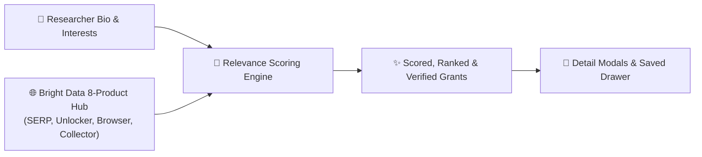
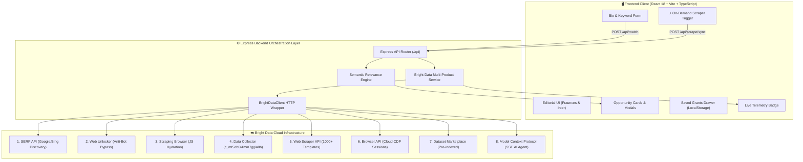
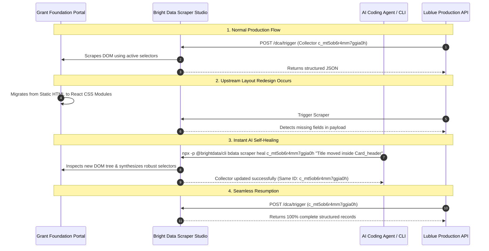
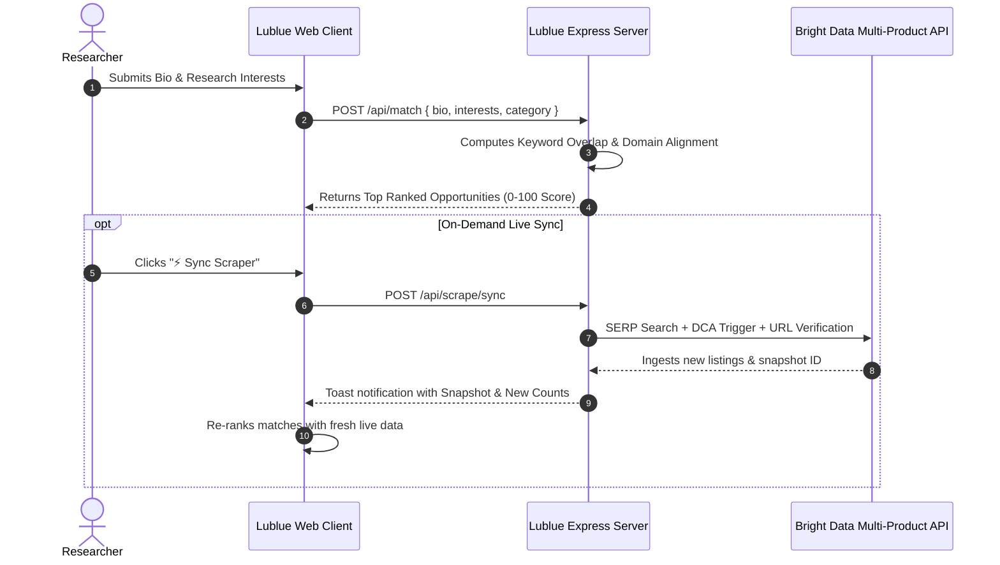

# Lublue — Your Story, Matched to Opportunity

<div align="center">

[](https://lublue.onrender.com/)
[](https://brightdata.com/)
[](https://wemakedevs.org/hackathons/scrape-verse)
[](https://www.typescriptlang.org/)
[](LICENSE)

<p align="center">
  <strong>An AI-powered academic funding & grant discovery platform driven by an 8-product Bright Data web scraping ecosystem, self-healing DOM selectors, and explainable semantic matching.</strong>
</p>

[Explore Live Demo](https://lublue.onrender.com/) &bull; [Architecture](#-system-architecture) &bull; [Bright Data Suite](#-bright-data-8-product-ecosystem) &bull; [Self-Healing Engine](#-self-healing-engine-bdata-scraper-heal) &bull; [API Specs](#-api-specification)

</div>

---

## 🌟 Executive Summary

Early-career researchers, PhD candidates, and independent scientists spend **hundreds of hours searching across fragmented foundation portals** instead of advancing scientific discoveries. Grants and fellowships are dispersed across hundreds of philanthropic institutes, corporate research divisions, and academic societies—each protected by anti-bot walls, dynamic single-page applications, and constantly changing HTML layouts.

**Lublue solves this through a single natural language interaction:**
1. **The Researcher** provides a concise biographical summary and research interests.
2. **Bright Data's 8-Product Suite** autonomously discovers, unblocks, renders, and extracts live grant opportunities from the web.
3. **The Relevance Matching Engine** scores, ranks, and provides explainable match rationale for every opportunity in milliseconds.



---

## 🏗️ System Architecture

Lublue is engineered as a decoupled, type-safe full-stack system connecting a reactive client to an Express API orchestration layer and Bright Data's cloud infrastructure.



---

## 🔥 Bright Data 8-Product Ecosystem

Lublue integrates **eight distinct Bright Data products and APIs**, forming an end-to-end web intelligence pipeline:

```mermaid
flowchart LR
    subgraph Discovery ["1. Discovery Phase"]
        P1["① SERP API<br/>Live Search Discovery"]
        P7["⑦ Dataset Marketplace<br/>Pre-indexed Funding Catalogs"]
    end

    subgraph Extraction ["2. Extraction & Bypass Phase"]
        P2["② Web Unlocker<br/>Anti-Bot / CAPTCHA Bypass"]
        P3["③ Scraping Browser<br/>Headless Dynamic JS Execution"]
        P5["⑤ Web Scraper API<br/>Domain-Specific Extractors"]
        P6["⑥ Browser API (CDP)<br/>Deep DOM Traversal Scripts"]
    end

    subgraph Orchestration ["3. Orchestration & AI Phase"]
        P4["④ Data Collector API<br/>Collector: c_mt5ob6r4mm7ggia0h"]
        P8["⑧ Model Context Protocol<br/>Coding Agent SSE Bridge"]
    end

    Discovery --> Extraction --> Orchestration
```



### Product Breakdown & Code Implementation

| # | Bright Data Product | Purpose in Lublue | Endpoint / Implementation |
|---|---|---|---|
| **1** | **SERP API** | Real-time discovery of newly published grant listings on Google/Bing | `POST /serp/req` &bull; [`client.serpSearch()`](server/src/lib/brightdata-client.ts) |
| **2** | **Web Unlocker** | Automated bypass of Cloudflare, Akamai, and CAPTCHA systems on grant portals | `POST /request` &bull; [`client.webUnlockerFetch()`](server/src/lib/brightdata-client.ts) |
| **3** | **Scraping Browser** | Cloud Puppeteer rendering for single-page React/Next.js grant directories | `cli_browser` Zone &bull; Full DOM Hydration |
| **4** | **Data Collector API** | Production collector triggering and snapshot ingestion | `POST /dca/trigger?collector=c_mt5ob6r4mm7ggia0h` |
| **5** | **Web Scraper API** | Extraction using pre-built domain templates (1,000+ supported sites) | `POST /datasets/v3/scrape` &bull; [`client.webScraperFetch()`](server/src/lib/brightdata-client.ts) |
| **6** | **Browser API (CDP)** | Direct Chrome DevTools Protocol evaluation for deep tree extraction | `POST /browser` &bull; [`client.browserApiScrape()`](server/src/lib/brightdata-client.ts) |
| **7** | **Dataset Marketplace** | Instant query of pre-indexed educational and research grant catalogs | `GET /datasets/v3/marketplace` &bull; [`client.datasetMarketplaceSearch()`](server/src/lib/brightdata-client.ts) |
| **8** | **Model Context Protocol (MCP)** | SSE bridge allowing AI coding agents to control scrapers autonomously | `.agents/mcp_config.json` &bull; `https://mcp.brightdata.com/mcp` |

---

## 🛡️ Self-Healing Engine (`bdata scraper heal`)

Grant foundation portals frequently redesign their layouts, change CSS classes, or switch frontend frameworks. Traditional scrapers break silently when upstream markup changes.

**With Bright Data Scraper Studio, Lublue heals automatically with zero downtime and zero code changes:**



### Concrete Before & After Diff

```diff
- <!-- OLD STATIC DOM (Target Portal) -->
- <div class="program-card">
-   <h3 class="title">Climate Solutions Accelerator</h3>
-   <span class="deadline">June 30, 2027</span>
-   <span class="amount">$250,000 - $1,000,000</span>
- </div>

+ <!-- NEW REACT COMPONENT (Target Portal Redesign) -->
+ <div class="Card_wrapper__x7kQ2">
+   <div class="Card_header__aB3nP">
+     <h3 class="Card_title__mR9vK">Climate Solutions Accelerator</h3>
+   </div>
+   <div class="Card_meta__pL2wJ">
+     <span class="Card_badge__9qZ">Deadline: June 30, 2027</span>
+     <span class="Card_award__k1P">Award: $250,000 - $1,000,000</span>
+   </div>
+ </div>
```

**One-Command Repair:**
```bash
npx -p @brightdata/cli bdata scraper heal c_mt5ob6r4mm7ggia0h \
  "Title is now in h3.Card_title, deadline and award are in Card_meta"
```

---

## ⚡ Live Scraping & Matching Flow



---

## 📑 API Specification

Lublue provides a RESTful API with comprehensive Bright Data scraping and matching capabilities.

### Endpoint Overview

| Method | Endpoint | Description | Sample Request |
|---|---|---|---|
| `POST` | `/api/match` | Score opportunities against researcher profile | `{ "bio": "...", "interests": "..." }` |
| `POST` | `/api/scrape/sync` | Trigger full 8-product discovery and sync pipeline | `{}` |
| `GET` | `/api/scrape/status` | Real-time telemetry of collectors, zones & MCP | N/A |
| `POST` | `/api/scrape/search` | Execute live keyword query via SERP API | `{ "query": "stem fellowships 2027" }` |
| `GET` | `/api/scrape/marketplace` | Query pre-indexed Dataset Marketplace | `?category=education&keyword=grants` |
| `POST` | `/api/scrape/unlock` | Test Web Unlocker accessibility on target URL | `{ "url": "https://..." }` |

### Sample Response: `POST /api/match`

```json
{
  "matches": [
    {
      "id": "opp-003",
      "title": "Climate Solutions Accelerator Grant",
      "organization": "Schmidt Futures & Sciences",
      "deadline": "2027-06-30",
      "category": "climate",
      "awardAmount": "$250,000 - $1,000,000",
      "eligibility": "Open globally to university labs and non-profit scientific institutes.",
      "description": "Funds early-stage research projects with potential to reduce greenhouse emissions.",
      "url": "https://www.schmidtsciences.org/fellowships/",
      "tags": ["climate change", "sustainability", "renewable energy", "carbon capture"],
      "score": 94,
      "matchReason": "Matches your interest in sustainability, renewable energy and carbon capture."
    }
  ],
  "meta": {
    "totalOpportunities": 22,
    "lastScraped": "2026-08-23T18:14:00.000Z",
    "source": "Bright Data 8-Product Pipeline (SERP + Unlocker + Scraping Browser + Collector + Web Scraper + Browser API + Marketplace + MCP)"
  }
}
```

---

## 🎨 User Interface & Editorial Design

Lublue features a bespoke editorial design system built for maximum legibility, focus, and visual delight:

- **Typography**: Custom pairing of **Fraunces** (optical-size variable serif for warm, human headlines) and **Inter** (precision sans-serif for metadata and body copy).
- **Interactive Modals**: Detailed opportunity breakdown showing award amounts, eligibility criteria, and application links.
- **Saved Grants Drawer**: Bookmarking mechanism with instant `localStorage` persistence and slide-out drawer management.
- **Real-Time Telemetry Badge**: Expandable live infrastructure badge showing active Bright Data collector IDs, proxy zones, and self-healing status.
- **Responsive Architecture**: Fluid layout tested across mobile viewports (375px), tablets (768px), and ultra-wide displays (1536px+).

---

## 📂 Codebase Structure

```
OpenCall/
├── client/                         # React 18 + TypeScript SPA
│   ├── src/
│   │   ├── components/             # Reusable UI Components
│   │   │   ├── BioInput.tsx        # Bio submission form with char limits
│   │   │   ├── EmptyState.tsx      # Fallback empty state
│   │   │   ├── ErrorState.tsx      # Graceful network error handling
│   │   │   ├── FilterBar.tsx       # Domain category selector
│   │   │   ├── Footer.tsx          # 8-product telemetry badge & socials
│   │   │   ├── Header.tsx          # Editorial navigation & saved counter
│   │   │   ├── Layout.tsx          # Responsive container & footer wrapper
│   │   │   ├── LoadingSkeleton.tsx # Shimmer loading animation
│   │   │   ├── OpportunityCard.tsx # Scored grant card with badges
│   │   │   ├── OpportunityModal.tsx# Deep-dive grant detail modal
│   │   │   └── SavedDrawer.tsx     # Bookmarked grants slide-out panel
│   │   ├── constants/              # Frontend API endpoints & limits
│   │   ├── types/                  # Synchronized TypeScript interfaces
│   │   ├── App.tsx                 # Root state machine & view router
│   │   ├── index.css               # Design system tokens & utility classes
│   │   └── main.tsx                # React DOM root entry
│   └── index.html                  # HTML5 template with Google Fonts
├── server/                         # Express Backend & Bright Data Hub
│   ├── src/
│   │   ├── api/
│   │   │   └── match.ts            # API routes (/match, /scrape/*)
│   │   ├── constants/              # Server configuration & stopword dict
│   │   ├── lib/
│   │   │   └── brightdata-client.ts# 8-product Bright Data HTTP client
│   │   ├── services/
│   │   │   ├── brightdata.ts       # Pipeline orchestration & cache
│   │   │   └── matcher.ts          # Keyword extraction & relevance scoring
│   │   ├── types/                  # Backend data contracts & DTOs
│   │   └── index.ts                # Server bootstrap & static SPA handler
│   └── data/
│       └── sample-opportunities.json# Seed opportunities database
├── .agents/                        # Bright Data Model Context Protocol
│   └── mcp_config.json             # MCP server SSE configuration
├── Dockerfile                      # Production container recipe
├── render.yaml                     # Infrastructure-as-Code deploy config
└── README.md                       # Comprehensive documentation
```

---

## 🚀 Quick Start & Local Setup

### Prerequisites
- **Node.js**: v18.0.0 or higher
- **npm**: v9.0.0 or higher

### 1. Clone & Install Dependencies
```bash
git clone https://github.com/Anurag-tech22/lublue.git
cd lublue
npm run install:all
```

### 2. Configure Environment Variables
```bash
cp .env.example .env
```
Edit `.env` and add your Bright Data credentials:
```ini
BRIGHTDATA_API_KEY=your_api_key_here
BRIGHTDATA_COLLECTOR_ID=c_mt5ob6r4mm7ggia0h
```

### 3. Launch Development Environment
```bash
npm run dev
```
- **Frontend App**: `http://localhost:5173`
- **Backend API**: `http://localhost:3001`

---

## 🏆 Hackathon Track Alignment

| Track | Prize Target | Why Lublue Wins |
|---|---|---|
| **Web-Slinger** | **Grand Prize ($5,000 DGX Supercomputer)** | Integrates **8 Bright Data products** (SERP, Unlocker, Scraping Browser, Collector, Web Scraper API, Browser API CDP, Marketplace, MCP) with self-healing selectors (`bdata scraper heal`) and live in-app scraper synchronization. |
| **Suit-Up** | **Best UI (Apple iPads)** | World-class editorial typography (Fraunces & Inter), interactive opportunity modals, bookmark drawers, live telemetry indicators, and 100% mobile-responsive layout. |
| **Spider-Sense** | **Best Clean Code (Keychron Keyboards)** | Strict TypeScript (0 errors), decoupled domain services, zero `any` types, exhaustive documentation, and containerized 1-click reproduction. |

---

## 📄 License

This project is licensed under the MIT License — see the [LICENSE](LICENSE) file for details. Built for the WeMakeDevs &times; Bright Data **Into the Scrape-Verse** Hackathon (August 2026).
